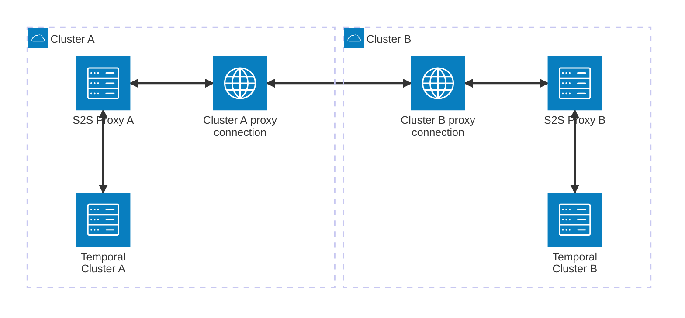

# S2S-Proxy for Temporal

A server-to-server proxy (s2s-proxy) is a service sitting between two Temporal servers. 
It can be used to intercept service requests between two servers in a [multi-cluster setting](https://docs.temporal.io/self-hosted-guide/multi-cluster-replication). 
It enables communication between two Temporal servers even if the servers are located in segregated networks. 
The proxy can be customized with access control policies, such as defining allow lists for APIs and namespaces, 
to enhance security. Using multiplex mode allows one server to connect to another server unidirectionally unlike 
a typical multi-cluster setup where both servers must expose an accessible endpoint.
## Contributing

See [CONTRIBUTING.md](./CONTRIBUTING.md) for how to build and run locally, run tests, etc.

## License

[MIT License](https://github.com/temporalio/s2s-proxy/blob/main/LICENSE)

*This project is intended for use as a binary only. Internal APIs are subject to change without warning!*

## When should I use the S2S proxy?
If you have two Temporal clusters with identical security posture and permitted entities,
you can connect them using Temporal's existing multi-cluster support and a secure network provider.
The S2S-Proxy is useful for connecting Temporal clusters that should *not* share a network for some reason,
or in cases where some translation is needed between the two clusters.

### Basic translation & Migration cases
Within the same network, you can use the S2S-proxy as a simple way to rename a namespace and/or search attributes
as it migrates into a different cluster. Configure the proxy in TCP mode with the two Temporal servers directly and
specify the namespace mapping between them.

### Crossing WAN with Mux-mode
Between two different networks, a server operator can cooperate with a client to connect a cluster between a publicly
exposed endpoint and the client's local Temporal Cluster, without ever exposing a port into the client deployment.
Setting the S2S-Proxy in Mux mode allows you to pick from Server and Client settings, and only the Server mode requires
an open port. The client connects to that port, handshakes with TLS, and then establishes a set of multiplexed sessions
for data transfer.

## S2S-Proxy network setup

## Features
The S2S-Proxy attempts to make it much easier to connect Temporal Clusters that do not share a trusted network.
Here's a short list of what it can do and how that helps you connect clusters.

### Avoid opening ports with multiplexed connections on TCP-TLS
The S2S-proxy supports establishing a multiplexed connection with Yamux to a remote endpoint. The mux is hosted
on top of TCP-TLS using a key and cert pair, ensuring it identifies to the correctly configured S2S-Proxy on the
remote side. The cluster containing the "establishing" proxy does not need any open ports, which simplifies 
the network posture on the establishing side.

### Enforce safety with Access Control Lists
Each S2S-Proxy can be configured with an allowlist of valid APIs, which prevents untrusted commands from running
on the cluster it represents.

### Translate namespaces and search attributes
Local and remote namespace names and search attributes can be renamed through the S2S-Proxy, to help a local
namespace confirm to what it should be on the remote. This skips the step of renaming the namespace by doing it
in-flight as it migrates.

### Adapt between different versions of Temporal
We will be keeping the Proxy updated with translations between modern versions of Temporal. The most notable 
recent incompatibility between servers is the switch from GoGo protobufs to Go-GRPC's reference protobufs.
GoGo protobuf allowed incomplete UTF-8 data inside of string objects, which is disallowed in Go-GRPC, which can
break some connections between Temporal <1.22 and Temporal >1.22. The S2S-proxy will remove those UTF8 errors
in-stream without the need to modify the data on the source Temporal deployment.

